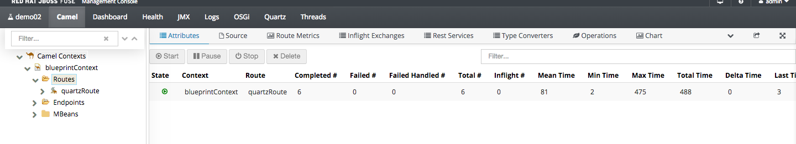

JBoss Fuse Quartz and FTP Demo
=====================================

This demos show how to Load balance your cron job using Quartz
We need to off-load the integration jobs and schedule them to run in less time during busy hours, this demo starts up two instance that runs the same cron jobs, the job simply writes a file to an FTP server. The job is implemented by Quartz2 and setting it to run twice every minute,both instances are connected to a database for clustering.
And lastly install a camel route reads from the ftp server and print out the result.


Setup
---------------
To setup the infrastructure for the demo download the follwoing files to the `installs` directory:

* jboss-fuse-full-6.2.0.redhat-133.zip

Add fabric server passwords for Maven Plugin to your ~/.m2/settings.xml file the fabric server's user and password so that the maven plugin can login to the fabric.

```
<server>
  <id>fabric8.upload.repo</id>
  <username>admin</username>
  <password>admin</password>
</server>
```

Make sure you have setup a FTP server in the local machine. and in project folder, under projects/demojobh2/src/main/fabric8, change the ftppassowrd to your ftp password
 
```
ftppassword=ZAQ!2wsx
```


OR
------
If you don't have a ftp server
You can change the FTP component to File.By change both file below

under projects/demojobh2/src/main/resources/OSGI-INF/blueprint/blueprint.xml
and 
under projects/demojobprint/src/main/resources/OSGI-INF/blueprint/blueprint.xml

Change the endpoint from 

```
sftp://demo@localhost?password={{ftppassword}}
```

to 

```
file:~/tempftp
```

To run the demo
-----------------

1. Open a terminal

   Clone this git repo TODO: add url

	    git clone <URL>

   Run the `init.sh` script to install JBoss Fuse and deploy the application
	   ```
	   sh init.sh
	   ```

2. Login to Fuse management console. Go to Services Tab, under container,

	   http://localhost:8181    (u:admin/p:admin)


3. Find container `demo01`, add profile `demo-quartzjobfrag` and `demo-quartzjob` to demo01 container


   Find container `demo02`, add profile `demo-quartzjobfrag` and `demo-quartzjob` to demo02 container


   Find container `demo03`, add profile `demo-quartzjobprint` to demo03 container


4. Go to target/jboss-fuse-6.2.0.redhat-133/bin
	 ```
	 sh client.sh
	 ```
	 
	 in the command console, connecto to demo02 container
	 ```
		container-connect demo02 
	 ```
	 
	 then modify the properties of instance name from ONE to TWO
	 ```
		config:edit MyDemoApp
	 config:propset instancename "TWO"
	 config:update 
	 ```
 
5. Go to Demo03 container by clicking on the link, and see the the jobs are run by different instances.
 
 
 

6. Done!


